# Adding Game Support

## Contents

- [Setting up Ghidra](#setting-up-ghidra)
- [Checking a New Game](#checking-a-new-game)
- [Creating a Blank Unreal Game](#creating-a-blank-unreal-game)
    - [Setup](#setup)
    - [Fixing `UnrealBuildTool.exe` not found on UE4](#fixing-unrealbuildtoolexe-not-found-on-ue4)
    - [Building the Game](#building-the-game)
- [Finding and Creating Signatures](#finding-and-creating-signatures)
    - [Setting up the Game Support File](#setting-up-the-game-support-file)
    - [General Strategies](#general-strategies)
        - [Creating a Signature](#creating-a-signature)
    - [Finding `GetPakSigningKeys`](#finding-getpaksigningkeys)
    - [Finding `GetPakFolders`](#finding-getpakfolders)
    - [Finding `GMalloc`](#finding-gmalloc)
    - [Finding `GetPakOrder`](#finding-getpakorder)
    - [Finding `FPakPlatformFile` methods (`PakOpenRead`, `PakOpenAsyncRead`, `FileExists`)](#finding-fpakplatformfile-methods-pakopenread-pakopenasyncread-fileexists)
    - [Finding `IsNonPakFilenameAllowed`](#finding-isnonpakfilenameallowed)
    - [Finding `FAsyncPackage2_StartLoading`](#finding-fasyncpackage2_startloading)
    - [Finding `GFNamePool`](#finding-gfnamepool)

## Setting up Ghidra

The guide uses [Ghidra](https://github.com/NationalSecurityAgency/ghidra/) as the software reverse engineering tool (For reference, Ghidra 12.0 was used, but any 12.x version should work). Once you have Ghidra installed, follow the installation for [ghidra-scripts](https://github.com/rirurin/ghidra-scripts) to get the `CheckUnrealEssentialsScans.java` script, which will assist in identifying what functions need to be replaced.

Note that in order to use `makesig.py`, you will need to launch Ghidra with the `pyghidraRun.bat` script inside of the support folder.

## Checking a New Game

If you have all the game files, you can check game support by adding the game to Reloaded-II, running it and seeing what signatures found a match. If everything was successfully found, then this game is supported!

If you only have the executable available, then you can add the exe into a new Ghidra project and then open the project but don't start analysis yet. Then, run the `CheckUnrealEssentialsScans.java` script. When the file selector window appear, select the YAML file for the *engine version used by that game* (this will be located in `UnrealEssentials/Signatures/Engine`): \
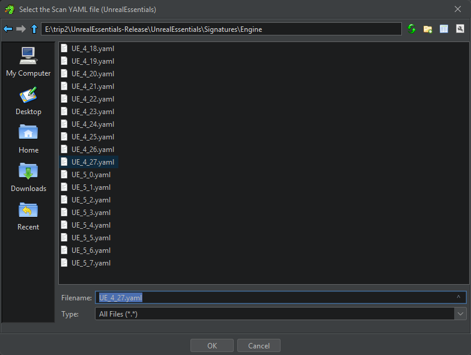

The console will print out what functions were found, followed by what functions couldn't be found: \
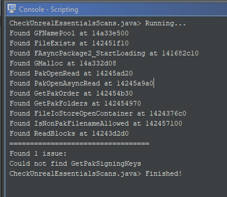

If `All signatures were found!` is printed at the end, then this game is supported!
If it reports an issue or two and the function(s) it couldn't find are `ReadBlocks` or `FileIoStoreOpenContainer`, **then the game is still supported since those definitions are unused**. Otherwise, if there are issues reported, then it means that this game will need to have a game support file created for it.

## Creating a Blank Unreal Game

### Setup

To make finding functions in the target game easier, we'll first create a sample Unreal Engine project using the same engine version that the game uses. In the `Unreal Engine` tab in Epic Games Launcher, you can install any UE4/UE5 version and they'll appear in your Engine Versions list: \
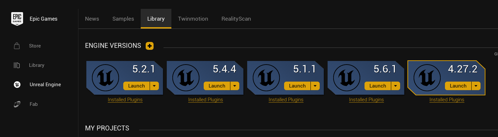

#### Fixing `UnrealBuildTool.exe` not found on UE4
If this issue occurs, go to your install directory for your UE version, then open `/Engine/Config/BaseEngine.ini`. At the bottom of the file, add
```ini
[PlatformPaths]
UnrealBuildTool=Engine/Binaries/DotNet/UnrealBuildTool.exe
```

In the project package settings, make sure that "Use Io Store" is on so that your blank game will have functions and symbols for IO Store functions.

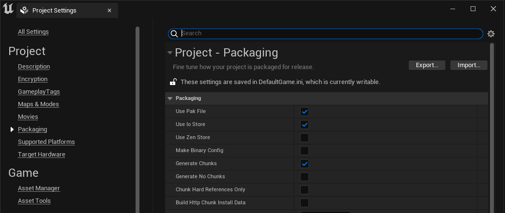

Then set the project build type to shipping as this is what production games are built with:

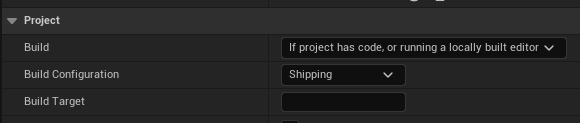


### Building the Game

Package the project to build the shipping executable:

| UE4 | UE5 |
| - | - |
| 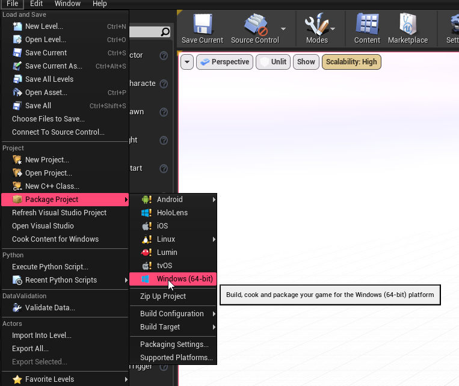 | 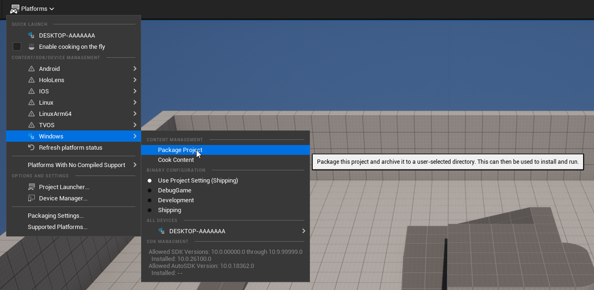 |

The output EXE and the accompanying PDB, which contains the debug symbols, will be available in `Binaries/Win64` and will be named `<ProjectName>-Win64-Shipping`:

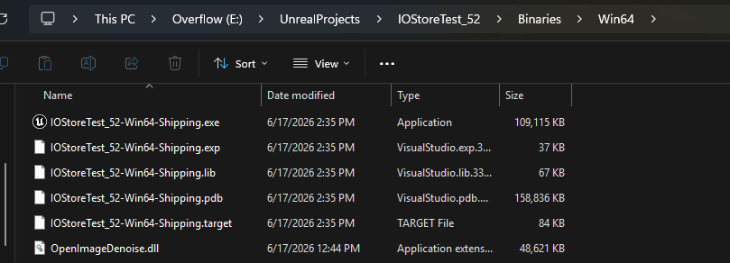

Insert the executable into Ghidra and run auto-analysis on it. It should automatically locate the PDB and import the debug symbols from it. You can now use it as a reference to help find functions in a game that uses that engine version (showing FileExists as an example):

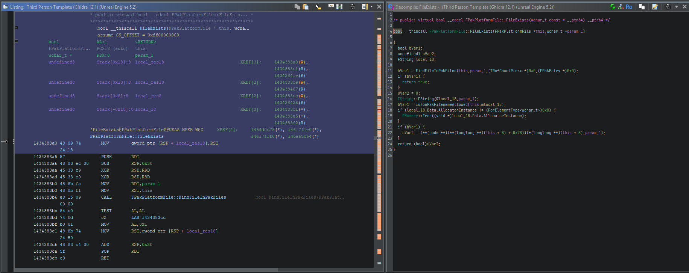

## Finding and Creating Signatures

Now that we know that there are some signatures that are missing, we can start auto-analysis by pressing A to bring up the Analysis Options and clicking Analyze.

The time that analysis will take will depend on your machine's specs, the size of the executable and whatever DRM scheme is used. If the game uses Denuvo, then do not wait for analysis to finish since it likely never will. My recommendation would be to wait a few hours since you should have the vast majority of the real functions analyzed by then.

### Setting up the Game Support File

In the `/Signatures/Game` folder, create a new YAML file. You can name it anything as long as it identifies what game it is.

Firstly, state the engine version. This must be named after a YAML file in `/Signatures/Engine`, since we'll use that as a base to retrieve signatures from that aren't being override by our game file.
For example, if we're adding support to a UE 5.3 game, the entry would be as follows:

```yaml
EngineVersion: "UE_5_3"
```

Next, we need some way for Unreal Essentials to know to use this file for the game.
This is usually accomplished by setting the `ExecutableName` field. In Persona 3 Reload, the game's exe is P3R.exe, so we the executable name set to P3R (don't include the file extension):

```yaml
ExecutableName: "P3R"
```

Most UE games will include the `[PlatformType]-Shipping` suffix in their executable name. To allow the same signature file to be used between Steam (Win64) and Gamepass (WinGDK), we can use `<DistVersion>` as a wildcard to match Win64 and WinGDK:

```yaml
# From Expedition 33:
ExecutableName: "Sandfall-<DistVersion>-Shipping"
# This will match Sandfall-Win64-Shipping and Sandfall-WinGDK-Shipping
```

There are some edge cases with game names, some of which have been accounted for. One example are games that don't use the `[PlatformType]-Shipping` naming convention but still have platform specific names.
Sonic Racing CrossWorlds does this, as the Steam version is named `SonicRacingCrossWorldsSteam`. In this case, `ExecutableNameStartsWith` is used instead:

```yaml
ExecutableNameStartsWith: "SonicRacingCrossWorlds"
```

A much funnier edge case is when a game company creates a UE game for the first time and uses a generic, non-identifying name such as "Game".
Rune Factory: Guardians of Azuma does this as it's Steam executable name is `Game-Win64-Shipping.exe`.
In this case, we can additionally check the product name of the program as listed in it's properties:

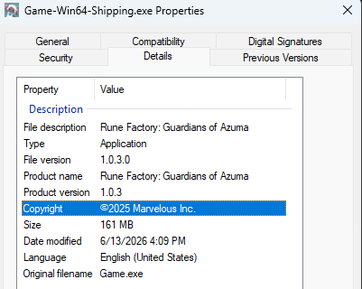

and then define "ProductName" as that:

```yaml
# can't use the executable name since that's just Game-Win64-Shipping LMAO
ProductName: "Rune Factory: Guardians of Azuma"
```

We now have what we need to start making our signatures!

### General Strategies

#### Creating a Signature

`makesig.py` is a script for generating a signature to locate an instruction within a function. This provides resistance against game updates which will shift where functions are within the executable.
To create a signature, select an instruction in the listing that you want to make a signature for, then run makesig on the instruction at cursor: \
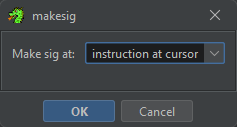

For example, if we've found the location of `IsNonPakFilenameAllowed`, we can make a direct signature by running makesig with the cursor at the start of the function:

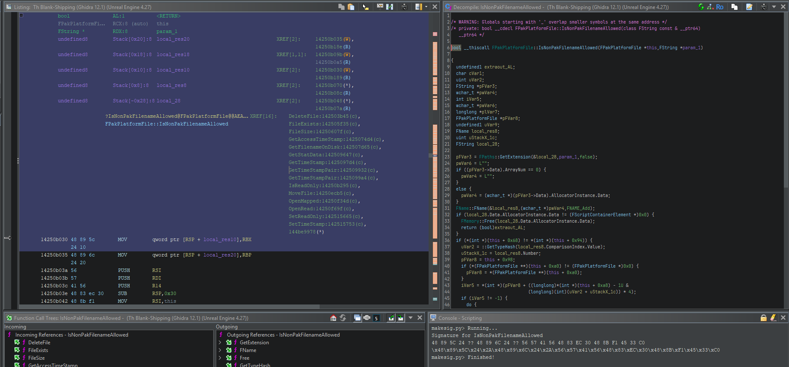

We can then add this as the value for `IsNonPakFilenameAllowed` within the `Signatures` list:

```yaml
Signatures:
    IsNonPakFilenameAllowed: "48 89 5C 24 ?? 48 89 6C 24 ?? 56 57 41 56 48 83 EC 30 48 8B F1 45 33 C0"
```

A signature can additionally be formatted in the following format:

```yaml
Signatures:
    IsNonPakFilenameAllowed:
        signatures: "48 89 5C 24 ?? 48 89 6C 24 ?? 56 57 41 56 48 83 EC 30 48 8B F1 45 33 C0"
```

If a game update breaks a signature, you can add compatibility for the latest version while retaining support for previous exe versions by specifying multiple signatures in an array:

```yaml
# in this format
IsNonPakFilenameAllowed: ["88 99 AA BB", "CC DD EE FF"]
# or this format
IsNonPakFilenameAllowed: 
    signatures: ["88 99 AA BB", "CC DD EE FF"]
```

If a direct signature does not work, you can also create a signature that indirectly points to the target function and use a transform to retrieve the function's address. An example would be using makesig on an instruction that calls `IsNonPakFilenameAllowed`:

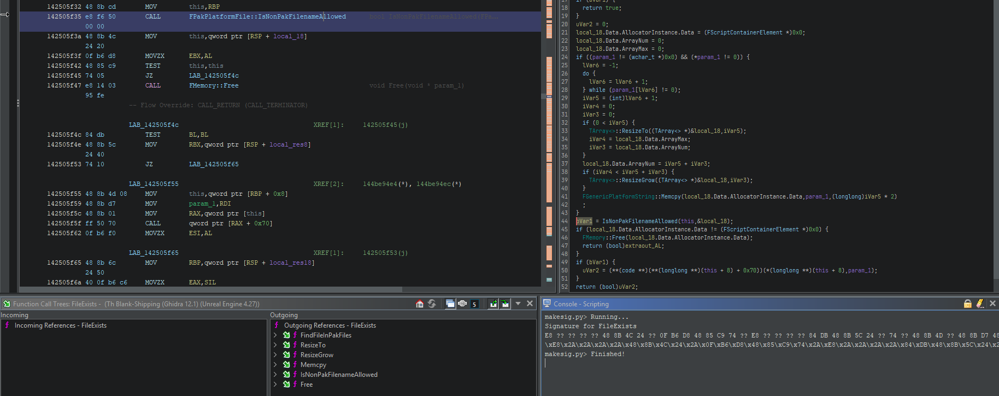

```yaml
Signatures:
    IsNonPakFilenameAllowed:
        signatures: "E8 ?? ?? ?? ?? 48 8B 4C 24 ?? 0F B6 D8 48 85 C9 74 ?? E8 ?? ?? ?? ?? 84 DB 48 8B 5C 24 ?? 74 ?? 48 8B 4D ?? 48 8B D7 48 8B 01 FF 50 ??"
        transforms: GetIndirectAddressShort
```

YAML scans includes a set of built in transforms that are commonly used to retrieve an address from a jump call or from a memory reference.
The most important ones are `GetIndirectAddressShort` and `GetIndirectAddressLong`, which both resolve a relative pointer embedded in an instruction.

For example, at the start of `FPakPlatformFile::FileExists` is a call to `FPakPlatformFile::FindFileInPakFiles`:

```
# from the Ghidra listing:
142505e96 e8 45 06        CALL       FPakPlatformFile::FindFileInPakFiles
          00 00
```

This call instruction is 5 bytes long, consisting of the call opcode (0xe8), then 4 bytes for the relative pointer (0x645):
```
0x142505e96 + length of instruction + relative pointer (45 06 00 00 -> 0x645, little endian)
= 0x142505e96 + 0x5 + 0x645 
= 0x1425064e0
```

If we go to that address, we'll see the start of `FPakPlatformFile::FindFileInPakFiles`. Since this is a 5 byte long instruction, the offset for the relative pointer is +1. GetIndirectAddressShort will read the relative pointer at the signature's resolved location + 1, so that's the transform that we'll use for this.

Another example is resolving a reference to a static memory address. Inside `FName::FName` (FName constructor), there's an instruction to load a pointer to `GFNamePool`:

```
# from the Ghidra listing:
                      LAB_140f495da                                   XREF[1]:     140f495cf(j)  
140f495da 48 8d 0d        LEA        this,[FNamePool]
          9f 3b 92 03

```

In this case, the instruction is 7 bytes, so the relative pointer is +3. In this case, we use the transform `GetIndirectAddressLong` instead to get `GFNamePool`.

Transforms are also compatible with multiple signatures, as long as you make sure that the length of the transform array is the same as the signature array:

```yaml
Signatures:
    IsNonPakFilenameAllowed:
        signatures: ["88 99 AA BB", "CC DD EE FF"]
        transforms: [GetIndirectAddressShort, GetIndirectAddressShort]
```

More details on supported syntax are available on the [YAML scans repository](https://github.com/rirurin/riri.yamlscans).

### Finding `GetPakSigningKeys`

> **Note** \
If this signature is broken and your game doesn't use IO Store, you don't have to look for this function. Ideally, it *should* fail since it won't be in the executable.


Known as `FCoreDelegates::GetPakSigningKeysDelegate` in the debug symbols, this is the function responsible for retrieving the signing keys to ensure that only unmodified archives are loaded. The function returns a static PakSigningKeysDelegate, which looks like this on the decompiler: \
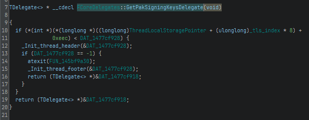

Notably, this is used in `FIoStoreTocResource::Read`, which can be located by searching for the hex sequence "2d 3d 3d 2d 2d 3d 3d 2d" in the Search Memroy window. This is the "magic sequence" that makes up the first 16 bytes of a UTOC file:

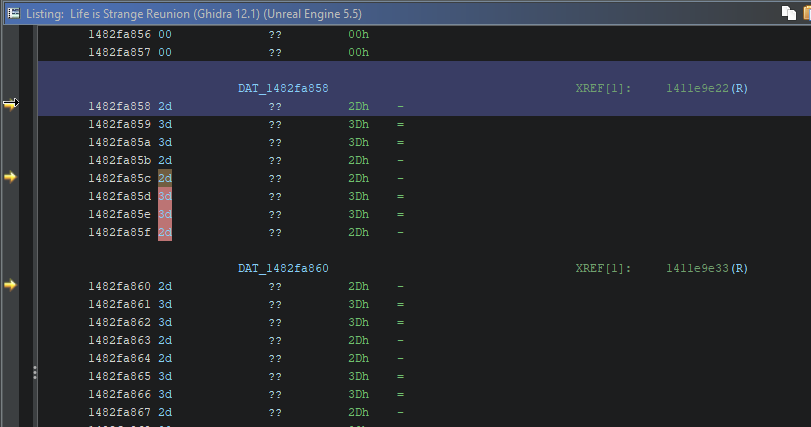
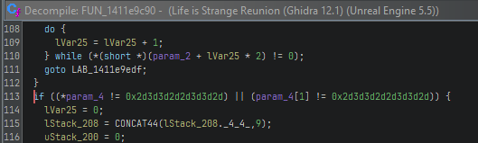

Using Life is Strange: Reunion (UE 5.5) as an example, we now know that `FUN_1411e9c90` is `FIoStoreTocResource::Read`.

Later in the function, there'll be a set of instructions in the decompiler that will look something like this:

| Engine (UE 5.5) | Game (Life is Strange: Reunion) |
| - | - |
| 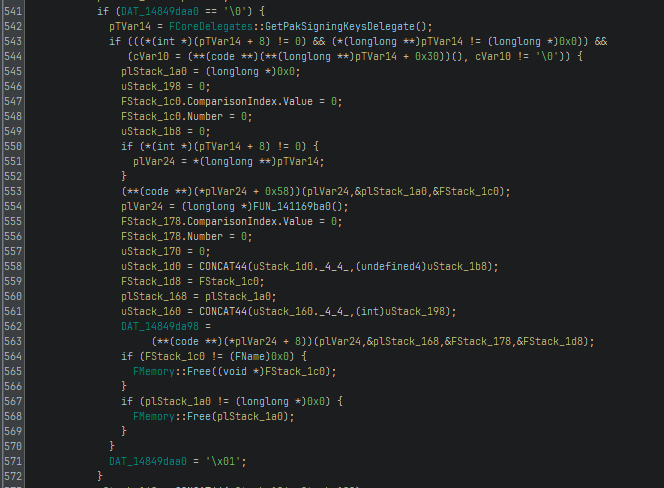 | 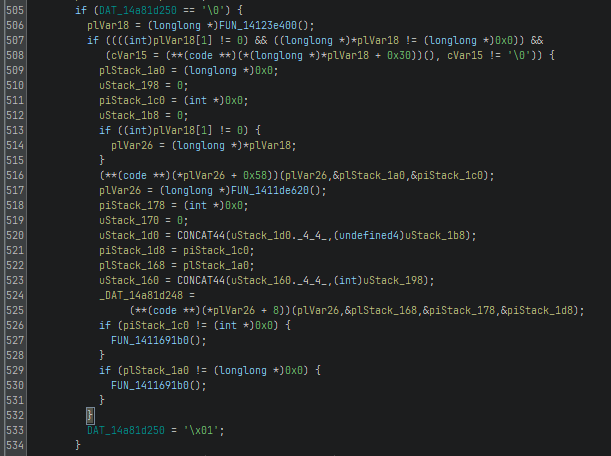

This section of the code retrieves the signing keys from `FCoreDelegates::GetPakSigningKeysDelegate`, then checks to see if the DelegateSize is more than zero and DelegateAllocator is not null.
If these are true, it'll call the virtual method at + 0x30 (more detail on virtual methods in [this section](#fpakplatformfile-methods-pakopenread-pakopenasyncread-fileexists)).
This is what performs the signing check. Since this holds true for the game, we now know that it's `GetPakSigningKeys` function is `FUN_14123e400`.

For this function, create an indirect signature since a direct signature won't be able to resolve to a single function.

### Finding `GetPakFolders`

This function is called `FPakPlatformFile::GetPakFolders` in the debug symbols. To find `GetPakFolders`, search for the string "%sPaks/" in the Search Memory window. Make sure that in the String Options, the encoding is set to UTF-16:

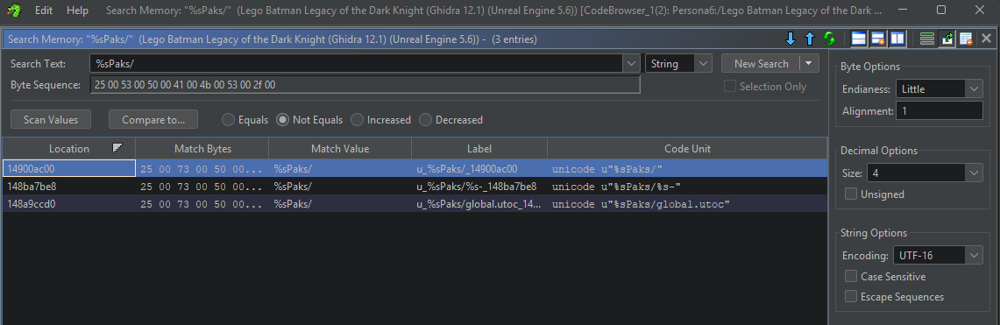 \
*From Lego Batman: Legacy of the Dark Knight (UE 5.6)*

It'll be the result that doesn't have anything after it.
When you open the string in the listing, the only references to it will be from `GetPakFolders`.
A direct signature is usually used for this function.

### Finding `GMalloc`

This is a static pointer to the memory allocator in use. Any function that has to allocate memory, such as resizing an array or freeing a resource that relies on allocation will call a function that calls GMalloc. For example, `GetPakFolders` has a call to `FMemory::Free` at the end, which has the following definition:

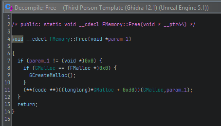 \
*Note that the vtable function offset will be different depending on the UE version. `FMemory::Free` is at +0x30 on UE 5.1*

GMalloc is referenced a lot, so pick a function whose contents look unique enough to create a good signature, then create an indirect signature.
For reference, UE 5.1's engine signature targets GMalloc from `FMemory::EnablePoisonTests`, while UE 5.4's engine signature targets it from `FMemory::GCreateMalloc`.

### Finding `GetPakOrder`

This function is called ` FPakPlatformFile::GetPakOrderFromPakFilePath` in the debug symbols. This is the same process as `GetPakFolders`, but we're instead looking for "%sPaks/%s-".

### Finding `FPakPlatformFile` methods (`PakOpenRead`, `PakOpenAsyncRead`, `FileExists`)

`PakOpenRead` (`FPakPlatformFile::OpenRead`), `PakOpenAsyncRead` (`FPakPlatformFile::OpenAsyncRead`) and `FileExists` (`FPakPlatformFile::FileExists`) are all virtual methods for the `FPakPlatformFile` class, which means that if we have at least one matching signature from this set, we'll be able to find the rest of the functions based on their offset from `FPakPlatformFile`s virtual table (vtable for short).

On UE4, you can easily find `OpenAsyncRead` by searching for the string "PakOpenAsyncRead" using UTF-8 encoding, which is only referenced by OpenAsyncRead (specifically by a call to `FCsvProfiler::BeginStat` and `FCsvProfiler::EndStat`, which isn't there on UE5):

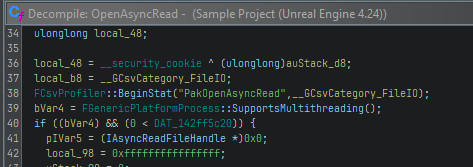 \
*From UE 4.24 sample project*

From there, you can check through the list of references (the XREFs next to the function declaration in the listing) to PakOpenAsyncRead until you find a reference within a list of function pointers. This is the vtable reference:

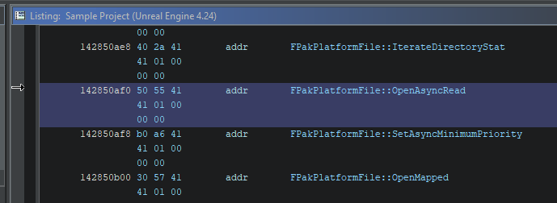

An alternative method to find the `FPakPlatformFile` vtable which works on UE5 is to search for the string "RSA" using UTF-16 encoding. This string is referenced in `FPakFileModule::StartupModule`, which looks like this:

| Engine (UE 4.27) | Game (Shin Megami Tensei V: Vengeance) |
| - | - |
| 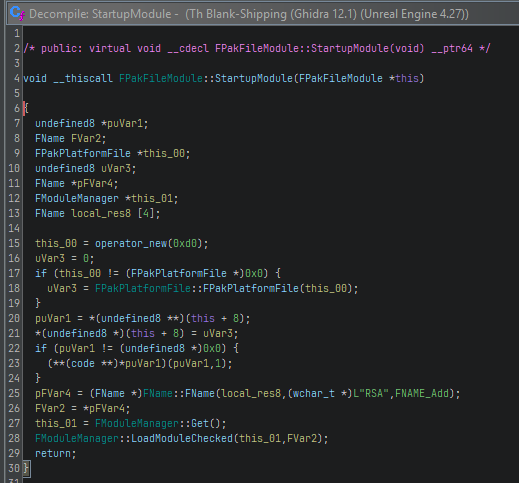 | 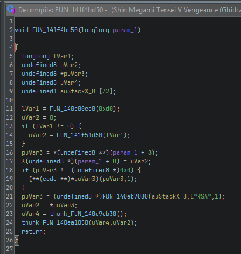

Enter `FPakPlatformFile::FPakPlatformFile`, which is the C++ constructor for `FPakPlatformFile`. At the beginning of the function will be a statement assigning the vtable to the start of the class structure:

| Engine (UE 4.27) | Game (Shin Megami Tensei V: Vengeance) |
| - | - |
| `*(undefined ***)this = &vftable;` | `*param_1 = &PTR_FUN_1437a1700;`

Now that we know that FPakPlatformFile's vtable is at 0x1437a1700, we can easily find the methods by accessing the function pointer at specific offsets.
In your project with debug symbols, note the vtable's address, then look through each of the virtual methods and note their addresses:

```
FPakPlatformFile::`vftable': 143beeb70

Function pointer locations:
FPakPlatformFile::FileExists: 143beebe0
FPakPlatformFile::OpenRead: 143beec30
FPakPlatformFile::OpenAsyncRead: 143beec88
```

For each of the function pointer locations, subtract the address by the vtable address:

```
FileExists: 0x143beebe0 - 0x143beeb70 = 0x70
OpenRead: 0x143beec30 - 0x143beeb70 = 0xc0
OpenAsyncRead: 0x143beec88 - 0x143beeb70 = 0x118
```

Now go back to the game project and from the vtable, access the function at that offset:

```
FileExists: *(0x1437a1700 + 0x70) = 0x141f5c5d0
OpenRead: *(0x1437a1700 + 0xc0) = 0x141f66440
OpenAsyncRead: *(0x1437a1700 + 0x118) = 0x141f65e30
```

Since there are no direct references to these functions as they are accessed as virtual methods, we'll have to use a direct signatures for these functions. The signatures generated for FileExists tend to be very long.

### Finding `IsNonPakFilenameAllowed`

`IsNonPakFilenameAllowed` (`FPakPlatformFile::IsNonPakFilenameAllowed`) is called by `PakOpenRead`:

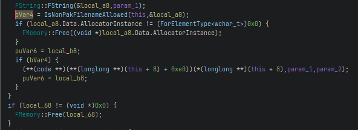 \
*From UE 5.3 sample project. Virtual function call may have a different offset depending on your UE version, it's 0xe0 in this case*

This can be identified by looking for a virtual function call that runs if the return value of `IsNonPakFilenameAllowed` is true.
A direct signature is usually used for this.

### Finding `FAsyncPackage2_StartLoading`

> **Note** \
If this signature is broken and your game doesn't use IO Store, you don't have to look for this function. Ideally, it *should* fail since it won't be in the executable.

I haven't been able to find any tricks to easily find this function, especially since the function definition changes quite frequently as seen in `UtocMethods.cs`.
My best suggestion is to make signatures in your debug symbol project either for calls to this function from a parent function or to the start of a parent function (anything that'll be listed in Incoming References) and see if you can get a match on your game's project.

### Finding `GFNamePool`

> **Note** \
This is only required for IO Store games since it's needed for the IO Store file log to work. However, GFNamePool is always initialized, so it will complain if this signature is missing. Because of that, I recommend searching for this anyway so people don't bring it up as an issue.

Any function that deals with FNames includes a section of code to lazily initialize `GFNamePool`:

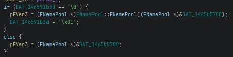

For any function listed in the Incoming References section for `FNamePool::FNamePool`, you can try creating an indirect signature in your debug symbols project to the `FNamePool` pointer that's passed as a parameter into the FNamePool constructor and see if it matches with your game project:

| Engine (UE 5.2) | Game (Life is Strange: Double Exposure) |
| - | - |
| 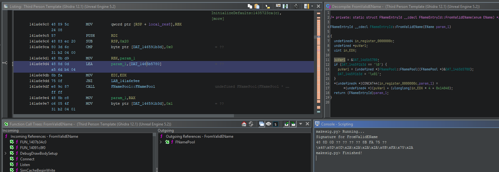 | 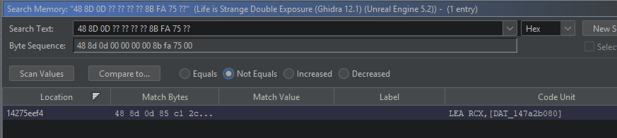

We get one match in this case, so this signature is good to use.