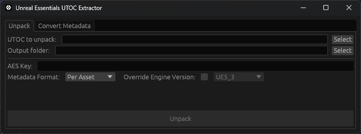
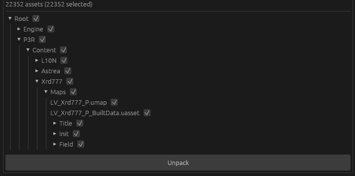
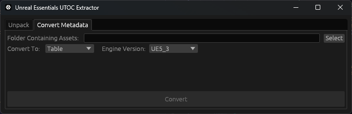

# UnrealEssentials
A mod for [Reloaded-II](https://reloaded-project.github.io/Reloaded-II/) that makes it easy for other mods to replace files in Unreal Engine games.

## Features
- Loading full UTOC and PAK files from mods
- Loading loose files from UTOCs and PAKs
- Removing signature checks so any file can be used
- Logging file access
- Support for UE 4.25-4.27 and UE 5 (see [Supported Games](#supported-games) for more details)
- API for adding file replacements from code (see [documentation](/UnrealEssentials.Interfaces/README.md))
- Tool for unpacking IO Store archives with asset metadata (see [Using the UTOC Extractor](#using-the-utoc-extractor))

## Planned Features
- Support for older UE4 versions
- Automatic conversion of cooked uassets to IO Store uassets (see note in [Loose Files](#loose-files))

## Supported Games
Below is a list of games that are known to work with Unreal Essentials. Just because a game isn't on the list doesn't mean it doesn't work, generally UE 4 games from 4.25-4.27 and UE 5 games from 5.0-5.7 will work.

If you know of a game that doesn't work you can create an [issue](https://github.com/AnimatedSwine37/UnrealEssentials/issues) and support might be added for it.

| Game       | UE Version | Support      |
|------------|-|------------|
| [Clair Obscur: Expedition 33](https://store.steampowered.com/app/1903340/Clair_Obscur_Expedition_33/) | 5.4 |
| [DRAGON BALL: Sparking! ZERO](https://store.steampowered.com/app/1790600/DRAGON_BALL_Sparking_ZERO/) | 5.1 |
| [Hi-Fi Rush](https://store.steampowered.com/app/1817230/HiFi_RUSH/)       | 4.27 | Requires [hibiki-bootstrap](https://github.com/akmubi/hibiki-bootstrap) |
| [Hogwarts Legacy](https://store.steampowered.com/app/990080/Hogwarts_Legacy/) | 4.27 |
| [HOLE](https://store.steampowered.com/app/2971610/HOLE/) | 5.5 |
| [Invincible VS](https://store.steampowered.com/app/2353060/Invincible_VS/) | 5.5 |
| [inZOI](https://store.steampowered.com/app/2456740/inZOI/) | 5.6 |
| [Jujutsu Kaisen: Cursed Clash](https://store.steampowered.com/app/1877020/Jujutsu_Kaisen_Cursed_Clash/) | 5.1 |
| [Life is Strange: Double Exposure](https://store.steampowered.com/app/1874000/Life_is_Strange_Double_Exposure/) | 5.2 |
| [Lego Batman: Legacy of the Dark Knight](https://store.steampowered.com/app/2215200/LEGO_Batman_Legacy_of_the_Dark_Knight/) | 5.6 |
| [Master Detective Archives RAIN CODE](https://store.steampowered.com/app/2903950/Master_Detective_Archives_RAIN_CODE_Plus/) | 4.27 | Need to use ASI Loader or remove DRM with [Steamless](https://github.com/atom0s/Steamless/)
| [Nobody Wants to Die](https://store.steampowered.com/app/1939970/Nobody_Wants_to_Die/) | 5.3 |
| [Outside the Blocks](https://store.steampowered.com/app/2350220/Outside_the_Blocks/) | 5.4 |
| [Persona 3 Reload](https://store.steampowered.com/app/2161700/Persona_3_Reload/) | 4.27 | Use [Persona 3 Reload Essentials](https://gamebanana.com/mods/494020) for game specific features
| [ROMEO IS A DEAD MAN](https://store.steampowered.com/app/3050900/ROMEO_IS_A_DEAD_MAN/) | 5.6 | Need to use ASI Loader or remove DRM with [Steamless](https://github.com/atom0s/Steamless/)
| [Rune Factory: Guardians of Azuma](https://store.steampowered.com/app/2864560/Rune_Factory_Guardians_of_Azuma/) | 5.4 |
| [Sackboy: A Big Adventure](https://store.steampowered.com/app/1599660/Sackboy_A_Big_Adventure/) | 4.25 |
| [SCARLET NEXUS](https://store.steampowered.com/app/775500/SCARLET_NEXUS/) | 4.25 |
| [Shin Megami Tensei V: Vengeance](https://store.steampowered.com/app/1875830/Shin_Megami_Tensei_V_Vengeance/) | 4.27 |
| [Sonic Racing: CrossWorlds](https://store.steampowered.com/app/2486820/Sonic_Racing_CrossWorlds/) | 5.4 |
| [Spirit City: Lofi Sessions](https://store.steampowered.com/app/2113850/Spirit_City_Lofi_Sessions/) | 5.7 |
| [Subnautica 2](https://store.steampowered.com/app/1962700/Subnautica_2/) | 5.6 |
| [The Adventures of Elliot: The Millennium Tales](https://store.steampowered.com/app/3483510/The_Adventures_of_Elliot_The_Millennium_Tales/) | 5.6 |
| [The Callisto Protocol](https://store.steampowered.com/app/1544020/The_Callisto_Protocol/) | 4.27 | Need to use ASI Loader or remove DRM with [Steamless](https://github.com/atom0s/Steamless/) |

## Usage
First you'll need to create a Reloaded mod and set Unreal Esentials as a dependency of it. For more details on making a mod check out Reloaded's [documentation](https://reloaded-project.github.io/Reloaded-II/CreatingMods/).

Next, open your mod's folder and create an `UnrealEssentials` folder inside of it, this is where you will put your edited files. 

### Adding Full Packages
To include a full package (`.utoc` + `.ucas` or `.pak`), place them anywhere in the `UnrealEssentials` folder. You can use subfolders if you'd like.

You do not need to suffix the file names with `_P` as you normally would if manually placing files in the game's folder, priority will automatically be sorted by Unreal Essentials (although if they do have `_P` in the name it won't hurt).

For example, a mod from Scarlet Nexus that uses full files looks like


### Adding Loose Assets

To include loose files put them in the `UnrealEssentials` folder, replicating their folder structure from the original game (this structure will generally start with `GameName/Content`).

Note that if your game uses UTOC files, any `.uasset` files you replace will have to come from a UTOC as the file format is different when they are in PAK files. This means that you will need to export them from Unreal Engine into an IO Store container ()`.utoc` + `.ucas` and then extract them if you want to use them loosely. This will be fixed at a later time.

For example, using [FModel](https://github.com/4sval/FModel) we could find the font files in Persona 3 Reload at `P3R/Content/Xrd777/Font`


To then replace one of these files we'd put our edited one in `UnrealEssentials/P3R/Content/Xrd777/Font` like


### Notes for Loose Zen Assets

*Zen Assets refer to assets originating from an IO Store container, which when unpacked will output a `.uasset` without any associated `.uexp`.*

There are some things to consider when using loose zen assets to ensure that your mod works as expected and to reduce loading times for the emulator.

For UE versions below 5.3, there is insufficient dependency information in the asset to accurately construct the imports and exports needed for the asset to function properly. While Unreal Essentials 1.x includes methods for deriving dependency info in UE4, the process is not perfect and there are occasionally files that don't resolve the right information, resulting in a game crash or other unintended behavior.

To resolve this, Unreal Essentials can use asset metadata that can be either defined per-asset in a `.uassetmeta` or for an entire mod in a `.utocmeta`. These files are generated [using the UTOC Extractor](#using-the-utoc-extractor).

For **UE 4.25 - 4.27**, asset metadata is optional to maintain backwards compatibility with 1.x. However, we recommend that mod authors use the UTOC extractor to generate asset metadata to avoid the issues detailed above.

For **UE 5.0 - 5.2**, asset metadata is required and UTOC emulator will fail with the message *"Asset metadata is required for UE5 versions before 5.3!"* if it is missing.

For **UE 5.3** and above, asset metadata is optional.

### Using the UTOC Extractor

A UTOC unpacking tool is available in both command line and graphical form in `utoc-extractor`.

*When performing an action for the first time, the program may freeze for several seconds while it downloads `oo2core_9_win64.dll` to allow for Oodle chunks to be decompressed. Additionally, the program comes with `config.ini` and `egui.ini` which are used by the [GUI](#gui).*

#### CLI

The CLI is used if utoc-extractor is executed with one or more parameters.

The following actions are available:

```
Usage: utoc-extractor.exe <COMMAND>

Commands:
  unpack
  convert
  help     Print this message or the help of the given subcommand(s)

Options:
  -h, --help  Print help
```

The unpacker extracts assets from an IO Store archive and copies them as loose Zen assets into the output folder. The following arguments are usable by the unpacker:

```
Usage: utoc-extractor.exe unpack [OPTIONS] <INPUT>

Arguments:
  <INPUT>  The file path to the .utoc to extract

Options:
      --aes-key <AES_KEY>

  -i, --include <INCLUDE>...
          Define a set of paths in the archive to extract. If not specified, everything will be extracted
  -m, --metadata <METADATA>
          [possible values: none, table, per-asset]
      --override-version <OVERRIDE_VERSION>
          [possible values: UE4_25, UE4_26, UE4_27, UE5_0, UE5_1, UE5_2, UE5_3, UE5_4, UE5_5, UE5_6, UE5_7]
      --root-name <ROOT_NAME>
          Set the name of the root folder. By default, this is "Game"
  -o, --output <OUTPUT>
          The folder to extract into. By default, this will be a in a folder adjacent to the .utoc
  -h, --help
          Print help
```

**Notes**:
- The `--root-name` option only applies if the mount point for the UTOC is at the root (`../../../`)

The converter allows for switching between asset metadata types for the input mod. An example use case is for a larger mod either doesn't include metadata or  uses `.uassetmeta` can be converted to use a `.utocmeta` before creating a public release to improve the performance of UTOC Emulator.

```
Usage: utoc-extractor.exe convert --metadata <METADATA> --version <VERSION> <INPUT>

Arguments:
  <INPUT>  The file path to your mod folder's UnrealEssentials folder

Options:
  -m, --metadata <METADATA>  [possible values: none, table, per-asset]
      --version <VERSION>    [possible values: UE4_25, UE4_26, UE4_27, UE5_0, UE5_1, UE5_2, UE5_3, UE5_4, UE5_5, UE5_6, UE5_7]
  -h, --help                 Print help
```

**Notes**:
- The action will not work if the engine version is set to below UE 5.3 and either the mod does not include metadata or the target metadata type is `none` due to the reasons mentioned in [Notes for Loose Zen Assets](#notes-for-loose-zen-assets)
- Only one asset metadata type is expected to exist in the mod, either a `.uassetmeta` *for each* `.uasset` or one `.utocmeta` inside the base `UnrealEssentials` folder
- If the current metadata type for the mod is the same as the targeted type in the command, then the action will not work since there is nothing to do


#### GUI

The GUI opens if utoc-extractor is executed without any parameters or is opened from your file explorer, showing the "Unpack" action by default:



When a `.utoc` is selected, a tree layout is constructed to display the layout of the IO Store Archive. You can select certain folders to be included or excluded from the unpacked output by clicking on the checkbox next to the directory/file name.

When unpacked, the file structure is automatically constructed to match the path layout needed by UTOC Emulator.



The "Convert Metadata" action allows for conversion between asset metadata types in the same way as the CLI:



Along with the executable are two INI files named `config.ini` and `egui.ini`.
`config.ini` allows for engine versions to be defined, which the metadata converter will automatically use if
the root folder of the package matches a certain name. In the example provided, if the path starts with P3R
(e.g `P3R/Content/Xrd777/...`) then the converter selects UE 4.27.

`egui.ini` stores the last directory location for each of the file/directory dialogs. Usually, when a file dialog is opened, Windows will always use the location of the last selected directory/file within the program as the starting directory. This can be inconvenient when switching between the unpack input and output, which may point to distant parts of your file system (unpack input in your UE project/Game's `Content/Paks` and unpack output in your mod's UnrealEssentials folder).

## Credits
- **[trumank](https://github.com/trumank)** and **[Archengius](https://github.com/Archengius)** - Developers of [retoc](https://github.com/trumank/retoc/), the serialization library used by UTOC Emulator
- **[Ray Cooper](https://github.com/raycopper)** - Testing with several production UE5 games